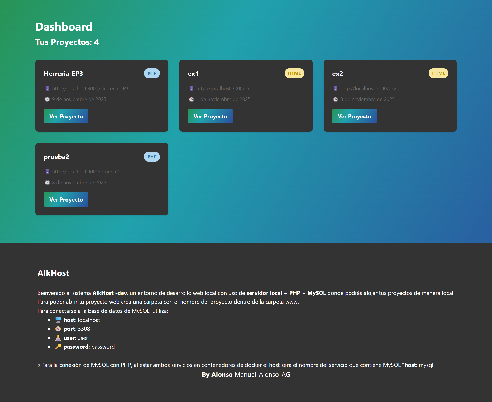
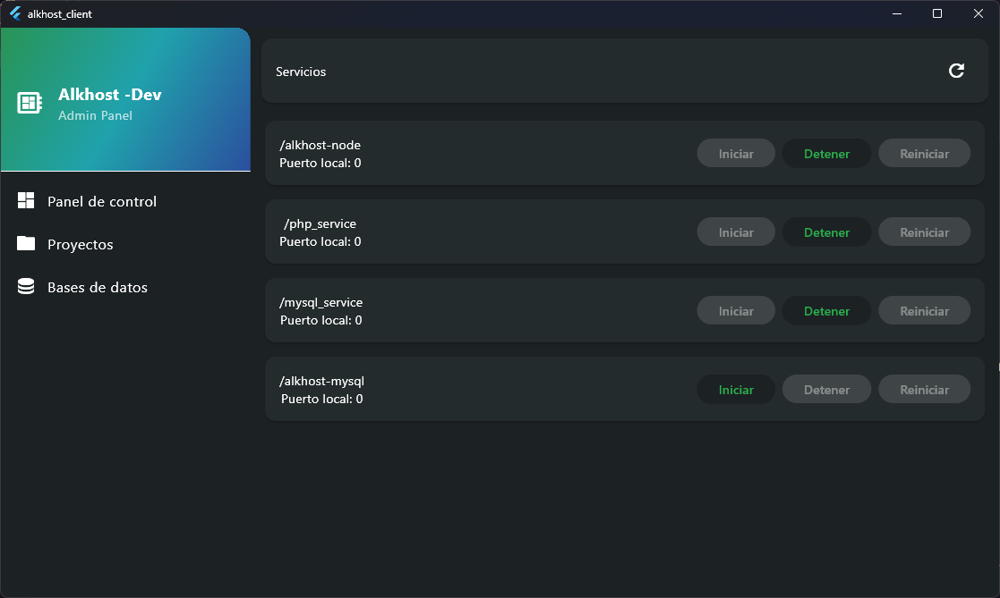

# Entorno de desarrollo web local


>[!IMPORTANT]
>Este proyecto se encuentra en desarrollo, para poder probarlo en su equipo se necesita tener node js y docker


Para poder arrancar con el programa, se necesita ingresar a Docker e iniciarlo.


Después, en una terminal ingresa:


```
cd server
docker compose up -d --build
```


Para ver los logs y verificar que no hay errores:


```
docker compose logs -f node
```


>[!NOTE]
>Este proyecto esta diseñado para manejar paginas web estaticas y dinamicas utilizando php ademas de manejar base de datos MySQL


